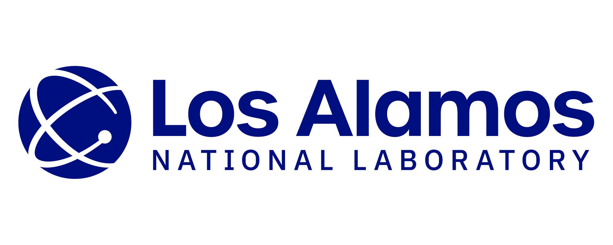
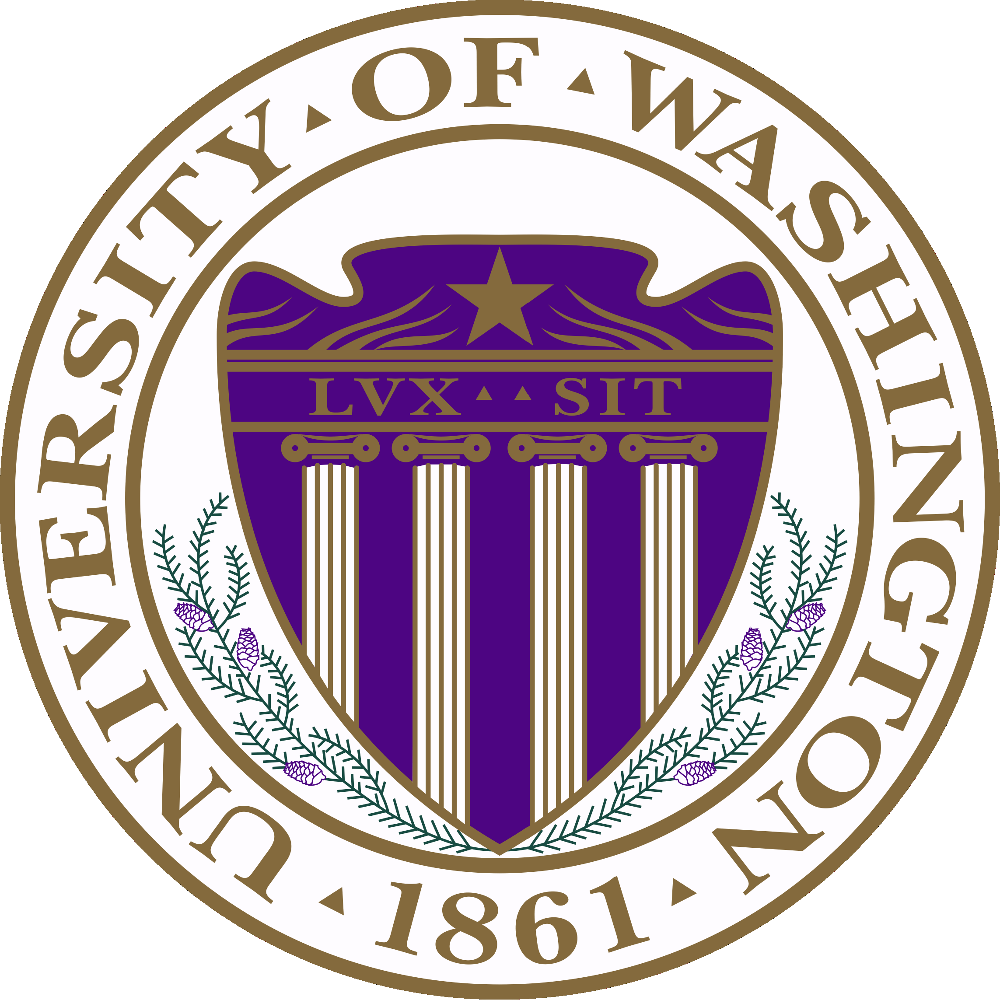
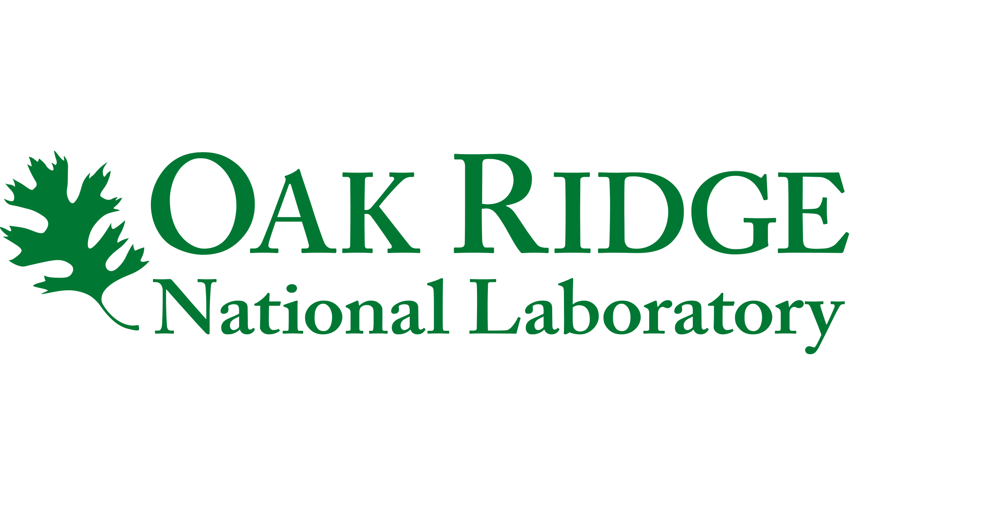

# Center for Hierarchical and Robust Modeling of Non-Equilibrium Transport (CHaRMNET) 

The center is motivated by the need to develop accurate long-term modeling of plasma systems for fusion energy and national security that are suitable for optimization and uncertainty quantification at the engineering scale.  Led by Michigan State University and Los Alamos National Laboratory, CHaRMNET brings together national leaders from five universities and four DOE national labs in the mathematical modeling of plasmas.  The center seeks to build a first-of-its-kind _holistic_ approach that will exploit structure within models to mitigate the curse of dimensionality and to bridge a wide range of length and time scales in plasma science. The curse of dimensionality is a critical challenge that is pervasive throughout computational science and refers to the observation that the resources needed to solve a problem on a computer scale exponentially with the dimension of the problem.  Fundamental plasma models are seven-dimensional and are presently computationally intractable (with existing mathematical methods and computational resources) to drive optimization and uncertainty quantification at the engineering scale of plasma systems.  

## Highlights

* A synergistic theoretical and data-driven approach to hierarchical modeling, including a wide range of surrogates
* Next-generation multi-resolution, mixed-model algorithms that provide a self-adaptive structure in terms of the methods and the models
* Structure and asymptotic preserving algorithms that enforce model consistency throughout the model hierarchy. 

## News

Date             | Message
---------------- | -----------------------------------------------------------------
Oct 20, 2022     | DOE is now accepting applications for  [CSGF](htpps://www.krellinst.org/csgf/).
Oct 18, 2022     | CHaRMNET team members gave talks in [APS DPP](https://engage.aps.org/dpp/meetings/annual-meeting).
Sep 26, 2022     | CHaRMNET team members gave talks in [SIAM MDS](https://www.siam.org/conferences/cm/conference/mds22).
Jun 21, 2022     | Luis Chacon (LANL) was awarded the [EO Lawrence Award](https://science.osti.gov/lawrence).

## Nine CHaRMNET partner institutions

&nbsp;

&nbsp;

&nbsp;

